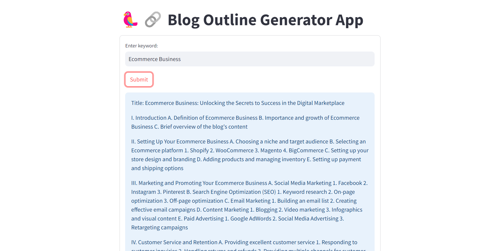

# Blog-outline-generator-app-using-langchain
Build a blog outline generator app using langchain. It is completely free to create and does not require any paid API like openAI.



Use the following instructions to run this app.

1. Fork this github repository.
2. copy the HTTPS or SSH address of your forked repo. 
3. open the terminal or VS_code to clone the repo using following commands
    ```
    git clone <github_repo_url>
    ```
4. cd into this cloned repo.
5. create a virtual environment and install the required libraries using following commands.
    ```
    pip install -r requirements.txt
    ```
6. create .env file and put your huggingface api key as 
    ```
    Huggingface_api=<your_huggingface_api_key>
    ```
7. open the terminal and run the following command to run streamlit app locally.
    ```
    streamlit run app.py
    ```

Enjoy your personal blog making app.
